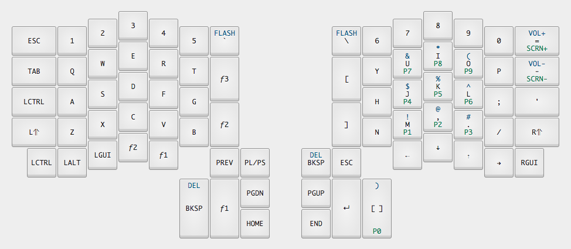

# Infinity Ergodox Layouts

### [Configurator](https://input.club/configurator-ergodox/)
### [Firmware Installation](https://input.club/configurator-setup/)
### macOS
1. Use homebrew to install dfu-util (`$ brew install`)
1. Press the flash button (orange led will turn on)
1. Flash using `$ dfu-util -D`
1. Orange led will turn off
1. Keyboard is ready to go
